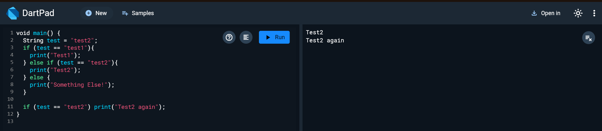
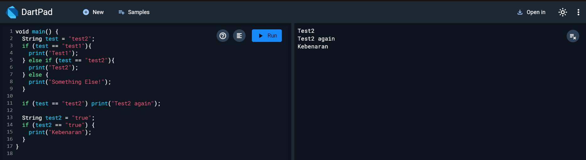
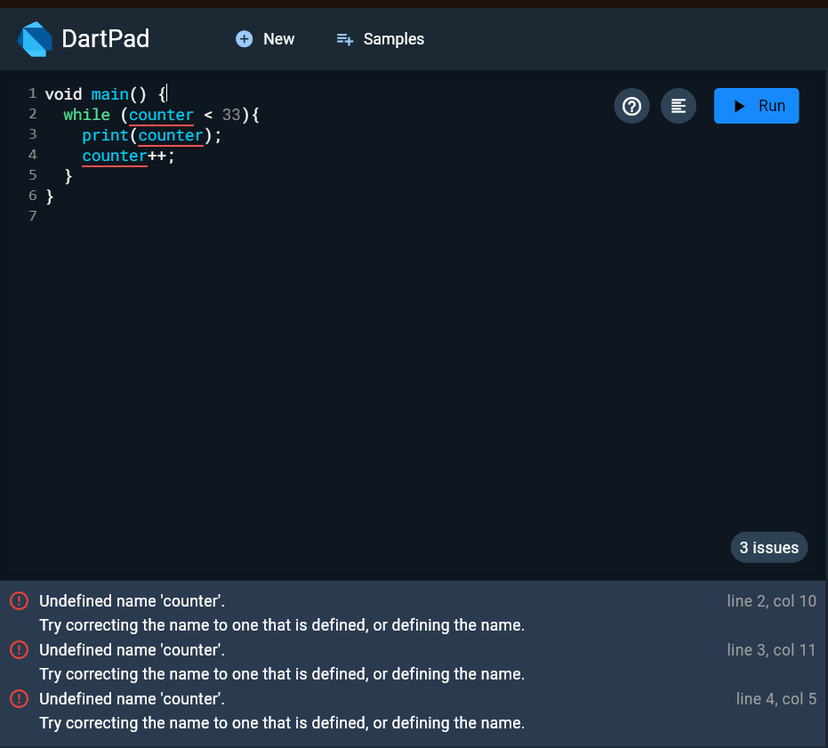
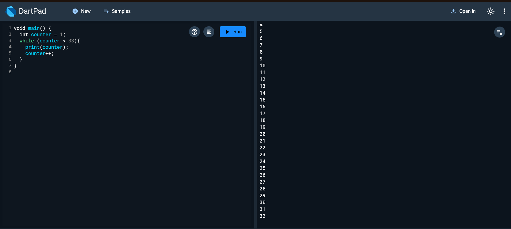
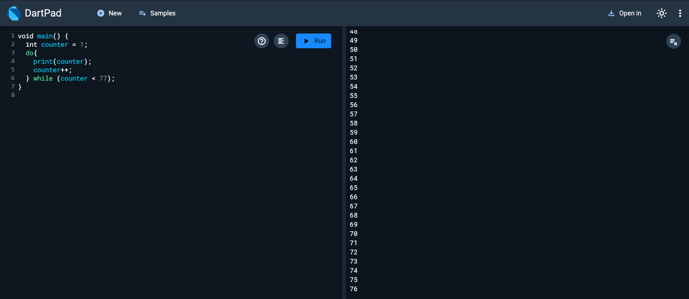
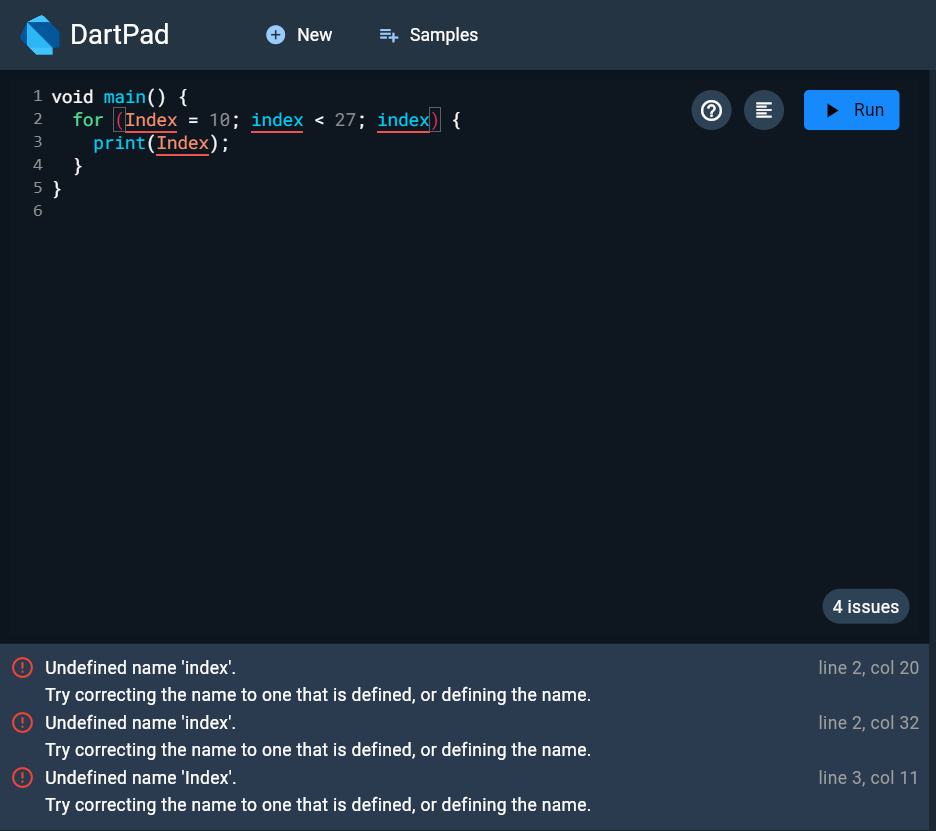
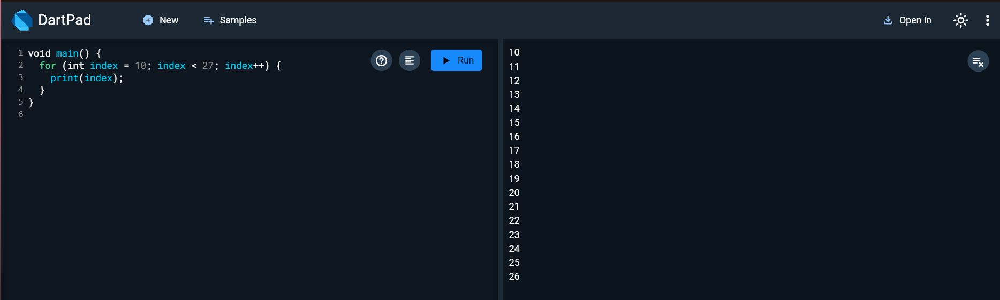
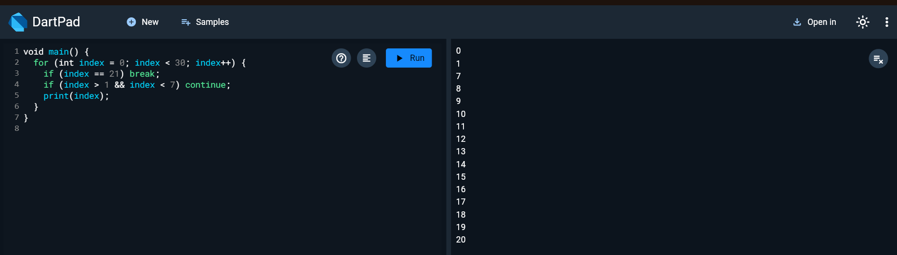
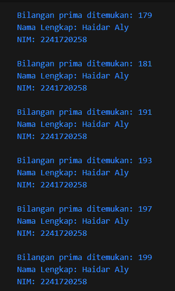

# Pemrograman Mobile Pertemuan Minggu 3

| Nama  :   | Haidar Aly |
| :--------: | :-------: |

| Kelas :  | TI-3F    |
| :--------: | :-------: |

| Absen : |  09  |
| :--------: | :-------: |

| NIM   :  | 2241720258   |
| :--------: | :-------: |

## Praktikum 1
### Langkah 1 - Menuliskan kode berikut ke dartpad
``` dart
String test = "test2";
if (test == "test1") {
   print("Test1");
} else If (test == "test2") {
   print("Test2");
} Else {
   print("Something else");
}

if (test == "test2") print("Test2 again");
```
### Langkah 2 - Eksekusi kode diatas dan analisa apakah ada error


### Langkah 3 - Mencoba kode baru serta eksekusi
#### Syntax
``` dart
String test = "true";
if (test) {
   print("Kebenaran");
}
```
#### Hasil

- Keterangan = sebelumnya terjadi error dimana variabel test sudah exist sehingga perlu membuat variabel baru dan kondisi if tidak ada yang dapat dibandingkan sehingga terjadi error perlu menambahkan pembanding

## Praktikum 2
### Langkah 1 - Menuliskan kode berikut ke dartpad
```dart
while (counter < 33) {
  print(counter);
  counter++;
}
```

### Langkah 2 - Eksekusi kode dan analisa apakah ada error

- Keterangan = Error diatas terjadi karena counter belum di deklarasi menjadi variabel sehingga perlu dibuat dulu variabel counter

#### Pembetulan


### Langkah 3 - Menambahkan kode baru dan analisa kesalahan
#### Syntax
```dart
do {
  print(counter);
  counter++;
} while (counter < 77);
```

#### Hasil

Keterangan = Jika hanya menambahkan kode diatas tanpa deklarasi counter seperti pada langkah 1, maka akan menyebabkan error yang sama seperti langkah 1

## Praktikum 3
### Langkah 1 - Menuliskan kode berikut ke dartpad
```dart
for (Index = 10; index < 27; index) {
  print(Index);
}
```

### Langkah 2 - Mengeksekusi kode dan analisa apakah ada kesalahan atau tidak

- Keterangan = error diatas yang pertama terjadi karena index menggunakan huruf kapital sebagai awalan dan itu tidak boleh sehingga harus diubah menjadi huruf kecil dan variabel index belum terdeklarasi sehingga harus dideklarasi terlebih dahulu

#### Pembetulan


### Langkah 3 - Menambahkan kode baru dan eksekusi kode
#### Syntax
```dart
If (Index == 21) break;
Else If (index > 1 || index < 7) continue;
print(index);
```

#### Hasil

- Keterangan = Pada kode diatas butuh perulangan for dan deklarasi index terlebih dahulu, sehingga pada gambar berikut sudah disertai pembenaran dari kode diatas

## Tugas
### Syntax
```dart
void main() {
  const namaLengkap = 'Haidar Aly';
  const nim = '2241720258';

  void cekBilanganPrima(int number) {
    if (number < 2) return;

    if (number == 2) {
      print('Bilangan prima ditemukan: $number');
      print('Nama Lengkap: $namaLengkap');
      print('NIM: $nim');
      print('');
      return;
    }

    if (number % 2 == 0) return;

    for (int i = 3; i <= number ~/ 2; i += 2) {
      if (number % i == 0) return;
    }

    print('Bilangan prima ditemukan: $number');
    print('Nama Lengkap: $namaLengkap');
    print('NIM: $nim');
    print('');
  }

  for (int i = 0; i <= 201; i++) {
    cekBilanganPrima(i);
  }
}
```
### Hasil
